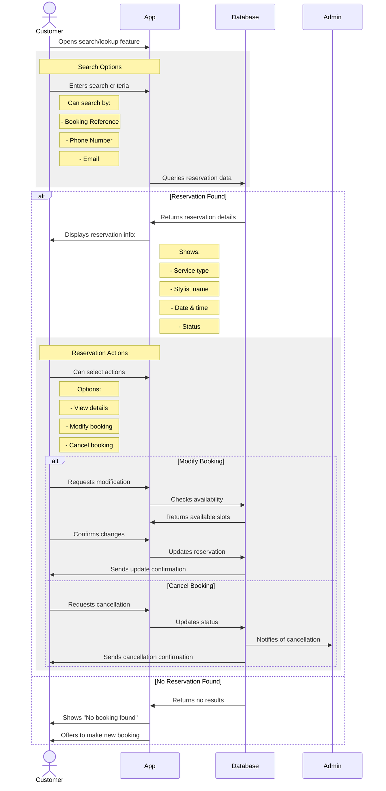

```mermaid
sequenceDiagram
    actor Customer
    participant App
    participant Database
    participant Admin

    Customer->>App: Opens search/lookup feature
    
    rect rgb(240, 240, 240)
        Note over Customer,App: Search Options
        Customer->>App: Enters search criteria
        Note right of Customer: Can search by:
        Note right of Customer: - Booking Reference
        Note right of Customer: - Phone Number
        Note right of Customer: - Email
        App->>Database: Queries reservation data
    end

    alt Reservation Found
        Database->>App: Returns reservation details
        App->>Customer: Displays reservation info:
        Note right of App: Shows:
        Note right of App: - Service type
        Note right of App: - Stylist name
        Note right of App: - Date & time
        Note right of App: - Status

        rect rgb(240, 240, 240)
            Note over Customer,App: Reservation Actions
            Customer->>App: Can select actions
            Note right of Customer: Options:
            Note right of Customer: - View details
            Note right of Customer: - Modify booking
            Note right of Customer: - Cancel booking
            
            alt Modify Booking
                Customer->>App: Requests modification
                App->>Database: Checks availability
                Database->>App: Returns available slots
                Customer->>App: Confirms changes
                App->>Database: Updates reservation
                Database->>Customer: Sends update confirmation
            else Cancel Booking
                Customer->>App: Requests cancellation
                App->>Database: Updates status
                Database->>Admin: Notifies of cancellation
                Database->>Customer: Sends cancellation confirmation
            end
        end

    else No Reservation Found
        Database->>App: Returns no results
        App->>Customer: Shows "No booking found"
        App->>Customer: Offers to make new booking
    end
```